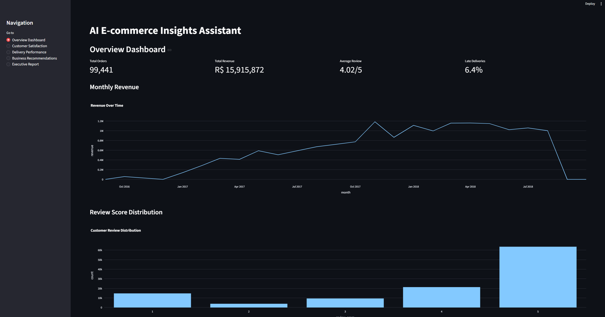
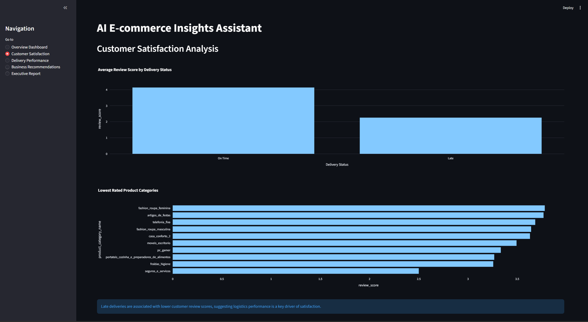
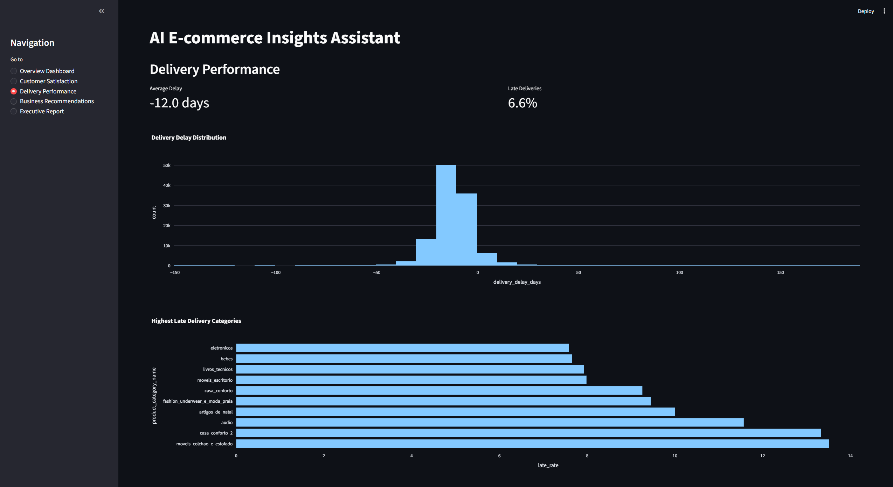
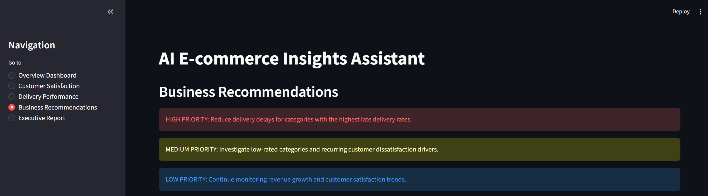

# AI E-commerce Insights Assistant

## Overview

AI E-commerce Insights Assistant is an interactive analytics application built on the Brazilian Olist e-commerce dataset, designed to simulate how modern analytics teams transform raw transactional data into business insights, operational diagnostics and executive recommendations.

The project combines structured analytics, automated insight generation and an interactive Streamlit dashboard to bridge the gap between traditional notebook-based analysis and practical business-facing analytics tools.

Beyond static analysis, the system includes an intent-driven query architecture and rule-based insight engine capable of dynamically generating recommendations based on business problems and operational patterns.

---

## Objectives

- Transform raw e-commerce data into structured business intelligence  
- Identify drivers of customer satisfaction, delivery performance and revenue generation  
- Build a reusable insight generation framework  
- Simulate an AI-assisted analytics workflow through dynamic business querying  
- Convert analytical outputs into an interactive decision-support application  

---

## Dataset

The project uses the publicly available **Olist Brazilian E-commerce Dataset**, containing:

- Orders and order items  
- Customer information  
- Product categories  
- Reviews and ratings  
- Delivery timestamps  
- Freight and pricing information  

---

## Application Features

The Streamlit application includes:

### Interactive KPI Dashboard
- Revenue tracking
- Order volume monitoring
- Review score analysis
- Delivery performance metrics

### Customer Satisfaction Analytics
- Review score distribution
- Delivery delay impact analysis
- Lowest-performing category diagnostics

### Delivery Performance Monitoring
- Delivery delay distribution
- Late delivery analysis
- Category-level logistics diagnostics

### Automated Business Recommendations
A rule-based recommendation engine that translates analytical findings into actionable business recommendations with different priority levels.

### Executive Report Generation
Automatically generates structured executive-style summaries of operational and customer experience performance.

---

## Methodology

The system is structured as a modular analytics pipeline.

### 1. Data Preparation
- Data cleaning and preprocessing  
- Feature engineering (delivery delays, revenue, late delivery indicators, etc.)  
- Timestamp handling and KPI construction  

### 2. Insight Engine
A rule-based analytics engine generates:
- Business insights  
- Operational implications  
- Recommended actions  

Covered analytical domains include:
- Customer satisfaction  
- Delivery performance  
- Revenue concentration  
- Freight costs  
- Review distribution  
- Product category performance  

### 3. Query-Based Insight System
The project includes an intent-driven analytical querying layer that:
- Classifies business questions  
- Routes requests to relevant analytical functions  
- Combines insights dynamically into structured responses  

### 4. Advanced Query Reasoning Layer
Enhances the system through:
- Multi-intent handling  
- Insight prioritization  
- Structured response generation  

### 5. Optional LLM Rewrite Layer
A lightweight FLAN-T5 model was integrated to improve readability and communication quality of generated outputs while preserving deterministic analytical logic.

---

## Example Business Questions

The system can answer questions such as:

- What operational factors are driving customer dissatisfaction?  
- How does delivery performance affect review scores?  
- Which product categories generate the most revenue?  
- What are the main business risks in the dataset?  
- Which operational metrics should leadership prioritize?  

---

## Key Findings

- Customer satisfaction is strongly associated with delivery performance relative to estimated delivery dates  
- Revenue is concentrated in a limited number of product categories, creating both opportunity and concentration risk  
- Freight cost varies substantially across categories and may impact customer experience and conversion  
- Delivery performance is one of the strongest operational indicators linked to customer review outcomes  

---

## Business Recommendations

- Treat delivery performance relative to estimated dates as a core operational KPI  
- Improve logistics performance in high-delay categories and regions  
- Investigate low-review categories for operational inefficiencies  
- Monitor freight cost trends across high-volume categories  
- Expand category diversification strategies to reduce concentration risk  

---

## Technologies Used

- Python  
- Pandas  
- Streamlit  
- Plotly  
- Scikit-learn  
- Jupyter Notebook  
- Hugging Face Transformers (FLAN-T5)  

---

## Application Screenshots

### Overview Dashboard



---

### Customer Satisfaction Analysis



---

### Delivery Performance Analysis



---

### Business Recommendations



---

## Limitations

- The insight engine is rule-based and does not continuously learn from new data  
- Query interpretation relies on intent classification rather than full autonomous reasoning  
- The optional LLM layer prioritizes interpretability and lightweight deployment over advanced generative reasoning  

---

## Future Improvements

- Deploy the application publicly using Streamlit Cloud  
- Integrate stronger LLM-based analytical reasoning  
- Add natural language querying directly through the interface  
- Introduce predictive delivery delay modeling  
- Expand customer segmentation and behavioral analytics  
- Add real-time dashboard capabilities  

---

## How to Run

Clone the repository:

```bash
git clone https://github.com/yourusername/ai-ecommerce-insights-agent.git
```

Install dependencies:

```bash
pip install -r requirements.txt
```

Run the Streamlit application:

```bash
streamlit run app.py
```

---

## Final Note

This project focuses on bridging the gap between data analysis and business decision-making by combining structured analytics, automated insight generation and interactive business-facing dashboards.

It reflects how modern analytics workflows increasingly move beyond static dashboards toward intelligent decision-support systems and AI-assisted business analytics tools.
